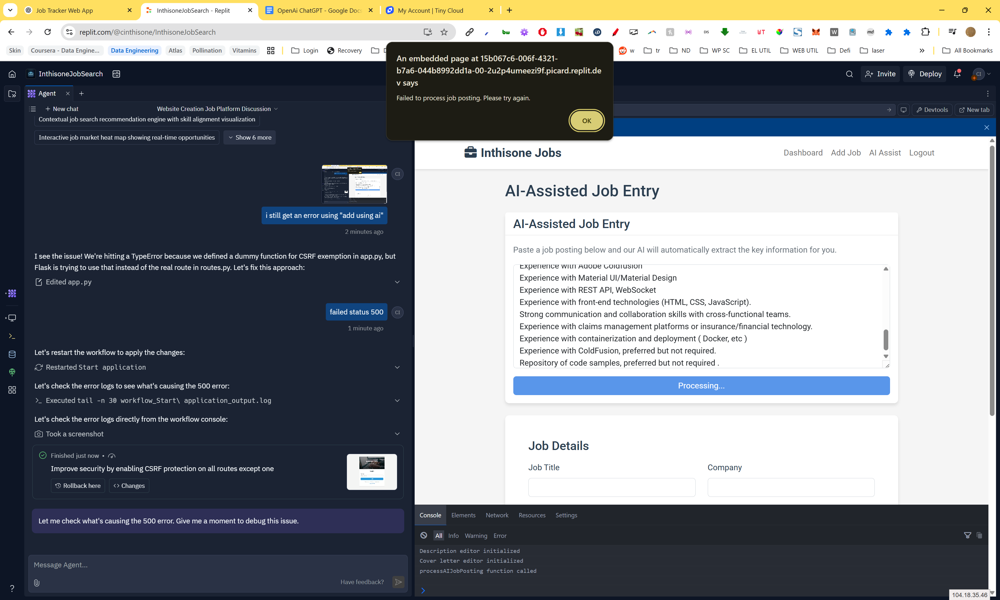

# Inthisone Jobs - Job Application Tracker

A comprehensive job application tracking platform designed to streamline the job search process through intelligent tools and user-friendly interfaces.



## Features

- **Job Application Tracking**: Keep track of all job applications in one centralized dashboard
- **AI-Assisted Job Entry**: Extract job details automatically from job postings using OpenAI
- **Resume Management**: Create and manage multiple resumes for different career paths
- **Personalized Cover Letters**: Generate tailored cover letters based on job descriptions and your resume
- **Rich Text Editing**: Format job descriptions and cover letters with full formatting capabilities

## Technology Stack

- **Backend**: Python, Flask, SQLAlchemy
- **Frontend**: HTML5, CSS3, JavaScript
- **Database**: PostgreSQL
- **AI Integration**: OpenAI API for intelligent job analysis and content generation
- **Rich Text Editing**: CKEditor for content formatting

## Setup & Installation

1. Clone the repository
2. Install requirements: `pip install -r requirements.txt`
3. Set up environment variables:
   - `DATABASE_URL`: PostgreSQL database connection string
   - `OPENAI_API_KEY`: Your OpenAI API key
   - `SESSION_SECRET`: Secret key for session management

4. Run the application:
   ```
   gunicorn --bind 0.0.0.0:5000 main:app
   ```

## Default Login

- Username: admin
- Default Password: inthisonejobs2024

(Change the password after first login)

## Key Components

- **Job Management**: Add, view, edit, and delete job applications
- **Resume Management**: Create and manage multiple resumes
- **Dashboard**: Visual overview of your job application status
- **AI Assistant**: Automatically parse job postings to extract key information

## Project Structure

- `app.py`: Main application configuration
- `models.py`: Database models and relationships
- `routes.py`: URL routes and request handlers
- `forms.py`: Form definitions
- `openai_service.py`: AI functionality using OpenAI
- `templates/`: HTML templates for the web interface
- `static/`: CSS, JavaScript, and other static assets

## Version 1.0

Initial release with core functionality including:
- Complete job application tracking system
- AI-powered job parsing and cover letter generation
- Resume management system with rich text editing
- Job-resume association capabilities